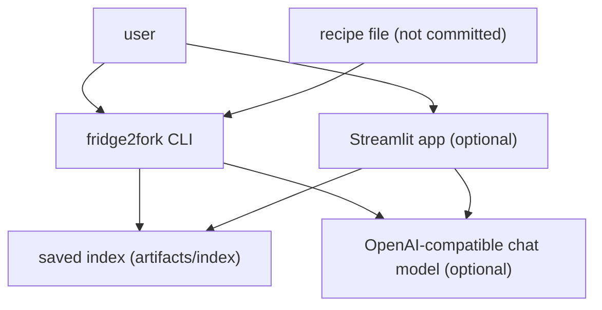
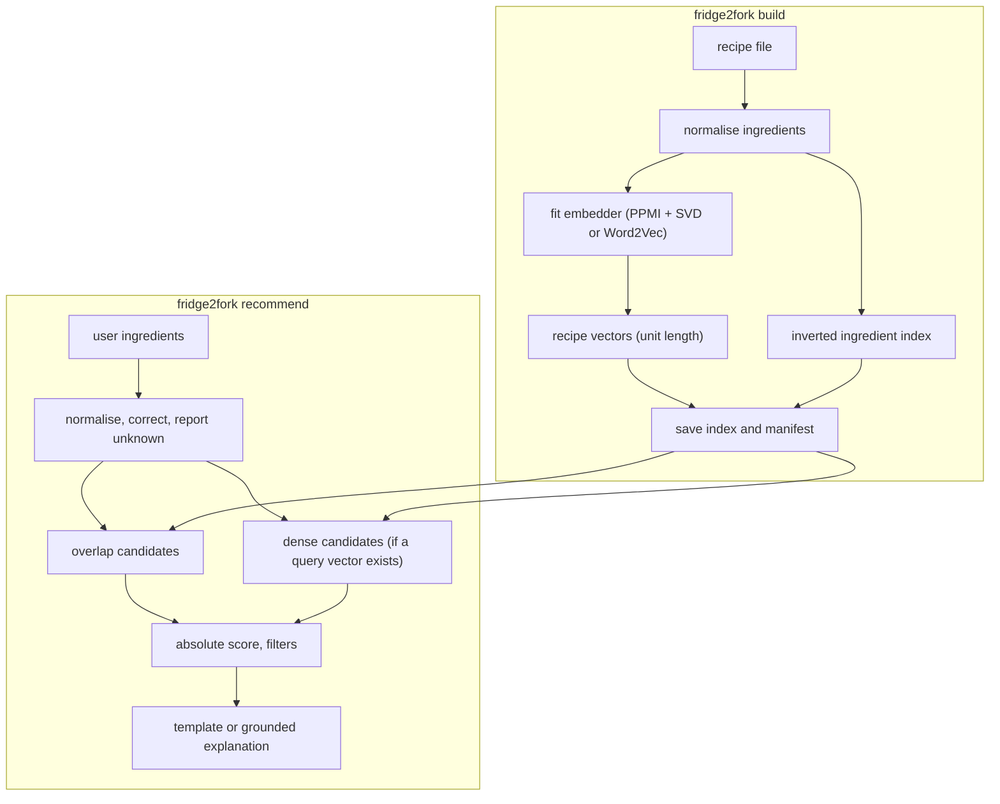

<div align="center">

# fridge2fork — Ingredient-Based Recipe Search With Grounded Explanations

**fridge2fork is a recipe recommender for people who want to cook with the ingredients that they have. It takes a list of ingredients through these steps to give ranked recipes with real steps:**

`normalise` → `retrieve (overlap + dense)` → `score` → `filter` → `explain (grounded)`.


**[Summary](#1-summary)** ·
**[Workflow](#4-the-end-to-end-workflow)** ·
**[Run it](#10-how-to-run-fridge2fork)** ·
**[Configuration](#104-environment-variables)** ·
**[Known problems](#13-known-problems)** ·
**[Glossary](#15-glossary)**

</div>

> [!NOTE]
> This README uses ASD-STE100 Simplified Technical English. The writing rules and the project
> vocabulary are in [`docs/ste-style-guide.md`](docs/ste-style-guide.md). Each term in the
> [Glossary](#15-glossary) has only one meaning.

---

fridge2fork finds recipes that use the ingredients that you have and that need few other ingredients. Two retrievers find candidates: an inverted ingredient index and a dense index of ingredient embeddings. A ranker with absolute scores sorts them. The steps in each explanation come from the recipe data, and an optional chat model only explains the match and suggests substitutions.

This README is the **one location that explains all of fridge2fork**. It gives these topics:

- the general design
- each component and its procedure, step by step
- the decision rules
- the data map
- the runbook
- the validation results and the known problems

| If you are… | Read |
|---|---|
| A manager or reviewer | [1](#1-summary), [3](#3-design-rules), [4](#4-the-end-to-end-workflow), [12](#12-validation-results), [14](#14-key-points) |
| A developer who joins the project | All sections, in sequence. Keep [10](#10-how-to-run-fridge2fork) and [13](#13-known-problems) open while you work |
| An operator who runs fridge2fork | [10](#10-how-to-run-fridge2fork), then the section for the component that you use |

---

## Table of contents

1. 🧭 [Summary](#1-summary)
2. 🏗️ [How fridge2fork is built](#2-how-fridge2fork-is-built)
   - 2.1 [Components](#21-components)
   - 2.2 [System context](#22-system-context)
   - 2.3 [Repository layout](#23-repository-layout)
3. 🛡️ [Design rules](#3-design-rules)
4. 🔄 [The end-to-end workflow](#4-the-end-to-end-workflow)
   - 4.1 [Full flow](#41-full-flow)
   - 4.2 [The life cycle of one query](#42-the-life-cycle-of-one-query)
5. 🔵 [Ingredient normalisation](#5-ingredient-normalisation)
6. 🟢 [Embeddings and indexes](#6-embeddings-and-indexes)
7. 🟣 [Grounded explanations](#7-grounded-explanations)
8. ⚖️ [The score and the filters](#8-the-score-and-the-filters)
9. 🗂️ [Data and file map](#9-data-and-file-map)
10. ▶️ [How to run fridge2fork](#10-how-to-run-fridge2fork)
    - 10.1 [Prerequisites](#101-prerequisites) · 10.2 [Installation](#102-installation) · 10.3 [Run fridge2fork](#103-run-fridge2fork) · 10.4 [Environment variables](#104-environment-variables)
11. 🧩 [How to extend fridge2fork](#11-how-to-extend-fridge2fork)
12. ✅ [Validation results](#12-validation-results)
13. ⚠️ [Known problems](#13-known-problems)
14. 📌 [Key points](#14-key-points)
15. 📖 [Glossary](#15-glossary)
16. 📄 [License](#16-license)

---

## 1. Summary

**The problem.** A user has some ingredients and wants a recipe. The difficult questions are:

- How do "2 large Tomatoes, chopped" and "tomato" become the same ingredient?
- What happens if the user types an ingredient that the data does not have?
- How do we find a recipe that uses many of the user's items, but has an unusual mix?
- How do we explain a recipe without invented steps, times or temperatures?

fridge2fork gives each of these questions its own component. An offline evaluation measures if the hidden recipe comes back.

| Item | Value |
|---|---|
| Input | A comma-separated ingredient list (CLI, Streamlit or Python) |
| Output | Ranked recipes with score, coverage, matched and missing ingredients, allergen warnings, the real steps |
| Components | **7**: normaliser, data loader, embedder, indexes, ranker, explainer, evaluation |
| Providers | Optional: an OpenAI-compatible chat model for explanations |
| Offline mode | Everything. The default embedder (PPMI + SVD), the NumPy index and the template explainer need no key and no network |
| Safety | Steps come from the data. A model reply with a new number or a step list is refused |
| Tests | **44** unit tests pass in CI (`pytest`), 2 skip without the `faiss` and `w2v` extras. With the `faiss` extra: 45 pass, 1 skips |


---

## 2. How fridge2fork is built

### 2.1 Components

| Component | Module | Purpose |
|---|---|---|
| Settings | `src/fridge2fork/config.py` | Environment variables and `.env`, with checks |
| Normaliser | `src/fridge2fork/normalize.py` | Canonical ingredient names, list parsing, spelling correction |
| Data loader | `src/fridge2fork/data.py` | Read CSV, JSON Lines or Parquet, validate, remove empty and duplicate recipes |
| Synthetic data | `src/fridge2fork/synthetic.py` | Made-up recipes in the Food.com layout |
| Embedder | `src/fridge2fork/embed.py` | PPMI + SVD (default) or Word2Vec (extra `w2v`), recipe vectors |
| Indexes | `src/fridge2fork/index.py` | NumPy or FAISS cosine index, inverted ingredient index |
| Ranker | `src/fridge2fork/rank.py` | Coverage, use, cosine and missing count, allergen and diet checks |
| Recommender | `src/fridge2fork/recommender.py` | Build, save, load and query |
| Explainer | `src/fridge2fork/explain.py` | Template explanation and grounded model explanation with a reply check |
| Chat models | `src/fridge2fork/llm.py` | `OpenAIChat` (extra `llm`) and `ScriptedLLM` (tests) |
| Evaluation | `src/fridge2fork/evaluate.py` | Hide-k-ingredients recall@k and MRR for three variants |
| Streamlit app | `src/fridge2fork/app.py` | Web page with a cached index (extra `ui`) |
| CLI | `src/fridge2fork/cli.py` | The `fridge2fork` command |

### 2.2 System context



### 2.3 Repository layout

```
fridge2fork/
├── .github/workflows/ci.yml   # pytest on Python 3.11
├── data/README.md             # source, terms, columns (no data files)
├── docs/ste-style-guide.md    # writing rules and project vocabulary
├── src/fridge2fork/           # the package (one module per component, see 2.1)
├── tests/                     # 46 offline tests on synthetic and hand-made recipes (2 need extras)
├── .env.example               # variable names only
├── pyproject.toml             # dependencies, extras, the fridge2fork command
└── LICENSE                    # MIT
```

---

## 3. Design rules

### 3.1 One normaliser for data and query
`normalize.canonical` removes quantities, units and descriptors, makes plurals singular and applies a synonym table. The data loader and the query matcher both use it. Thus matched and missing lists compare the same names.

### 3.2 No zero vector
If no query ingredient has an embedding, the query vector is `None` and the dense retriever does not run. A recipe with no embedded ingredient is never a dense hit. The result tells the user which ingredients were unknown or corrected.

### 3.3 Two retrievers, one candidate set
The candidates are the recipes with the largest ingredient overlap (`FRIDGE2FORK_OVERLAP_K`) plus the dense top `FRIDGE2FORK_DENSE_K`. A recipe with a high overlap is a candidate even if its mean vector is far from the query.

### 3.4 Absolute scores
Each score uses only the recipe and the query. No value is scaled by the other candidates. An exact match gets a finite score.

### 3.5 Steps come from the data
The explanation shows the steps of the recipe file. The chat model gets those steps, temperature 0 and an instruction not to write steps. `explain.check_reply` refuses a reply with a number that is not in the recipe or with a numbered step list.

### 3.6 Build once, load many times
`fridge2fork build` saves the recipes, the ingredient vectors, the vocabulary and a manifest. The CLI loads the saved index. The Streamlit app loads it once per server process with `st.cache_resource`.

### 3.7 Keys only from the environment
The chat model reads `OPENAI_API_KEY` from the environment or from `.env`. The adapter uses the current `openai` SDK (1.x). No key is in the code.

---

## 4. The end-to-end workflow

### 4.1 Full flow



### 4.2 The life cycle of one query

1. Split the user text on commas, semicolons or new lines.
2. Normalise each item to a canonical name.
3. If the name is not in the vocabulary, find a close spelling (similarity 0.85 or more).
4. Report each corrected item and each unknown item.
5. Get the overlap candidates from the inverted index.
6. If a query vector exists, get the dense candidates from the vector index.
7. Score each candidate and remove the candidates that fail a filter.
8. Sort by score, then by the missing count, then by recipe id.
9. Show the top k recipes with the template or the grounded explanation.

---

## 5. Ingredient normalisation

**Purpose.** Give one canonical name to each ingredient in the data and in the query.

| Input | Output |
|---|---|
| A raw ingredient string, for example `2 tbsp extra virgin olive oil` | A canonical name, for example `olive oil` |

**Procedure**

1. Make the text lower case.
2. Remove text in brackets and the text after the first comma.
3. Remove numbers, fractions, units (`cup`, `tbsp`, `can`, …) and descriptors (`chopped`, `fresh`, `large`, …).
4. Make each word singular (rules plus an exception table).
5. Replace the name with its synonym target (`scallion` → `green onion`, `garbanzo bean` → `chickpea`).

**Rules**

- A list cell is read as JSON, then as a Python literal, then as comma-separated text. Commas and apostrophes inside quoted items stay.
- Duplicate names in one recipe count once.
- A recipe with no ingredient after normalisation is removed. A recipe with the same name and ingredients as an earlier one is removed.

| Raw text | Canonical name |
|---|---|
| `2 large Tomatoes, chopped` | `tomato` |
| `1 can garbanzo beans, drained` | `chickpea` |
| `1/2 cup all-purpose flour` | `flour` |
| `black pepper` | `pepper` |
| `1 (14 ounce) can coconut milk` | `coconut milk` |

---

## 6. Embeddings and indexes

**Purpose.** Find recipes with similar ingredient mixes (dense) and recipes with many shared ingredients (overlap).

| Input | Output |
|---|---|
| Normalised recipes | Ingredient vectors, recipe vectors, a vector index and an inverted index |

**Procedure**

1. Keep the ingredients that occur in at least `FRIDGE2FORK_MIN_COUNT` recipes (default 2).
2. Count how often two ingredients occur in the same recipe (a sparse matrix product).
3. Keep the positive pointwise mutual information (PPMI) values.
4. Reduce the PPMI matrix to `FRIDGE2FORK_DIM` dimensions (default 64) with a seeded `TruncatedSVD`.
5. Make each ingredient vector unit length.
6. Make each recipe vector: the mean of its ingredient vectors, then unit length.
7. Put the recipe vectors in the NumPy index (exact cosine) or the FAISS `IndexFlatIP` index.
8. Put all recipe-ingredient pairs in the inverted index (a sparse incidence matrix).

**Rules**

- The Word2Vec embedder (extra `w2v`) uses skip-gram, a fixed seed and one worker, so it is reproducible.
- The inverted index uses all ingredients, also the ingredients below `FRIDGE2FORK_MIN_COUNT`.
- `manifest.json` records the embedder, the dimension, the seed, the counts and the SHA-256 value of the recipe file.

---

## 7. Grounded explanations

**Purpose.** Tell the user why a recipe fits and what to use instead of a missing item, with the real steps.

| Input | Output |
|---|---|
| One recommendation and the user ingredients | Explanation text, its source (`template` or the model name) and a note |

**Procedure (model explanation)**

1. Put the recipe name, the raw ingredients, the real steps, the matched and missing lists and the known substitutions in the prompt.
2. Send the prompt with temperature 0 and a system rule: no steps, no times, no temperatures, no new ingredients.
3. Check the reply with `check_reply`.
4. If the reply passes, add the real steps after it.
5. If the reply fails or the model raises an error, use the template explanation and record the reason.

| Reply check | Result |
|---|---|
| Empty reply | Refused |
| A number that is not in the recipe or in the substitution table | Refused |
| Two or more numbered step lines | Refused |
| Model error (timeout, network, key) | Template, with the error type in the note |

The template explanation gives the coverage, the matched and missing lists, substitutions from a fixed table, allergen warnings and the real steps.

---

## 8. The score and the filters

score = 0.5 × coverage + 0.25 × use + 0.25 × (cosine + 1) / 2 − 0.1 × min(missing, 10) / 10

| Feature | Meaning | Weight |
|---|---|---|
| coverage | Share of the recipe ingredients that the user has (pantry items count as owned) | 0.5 |
| use | Share of the user ingredients that the recipe uses | 0.25 |
| cosine | Cosine of the query vector and the recipe vector, 0 if one of them is absent | 0.25 |
| missing | Number of recipe ingredients that the user does not have | −0.1, up to 10 items |

| Filter | Setting | Effect |
|---|---|---|
| Maximum missing | `FRIDGE2FORK_MAX_MISSING`, `--max-missing` | Removes recipes with more missing items |
| Allergen groups | `--exclude dairy` (repeat for more) | Removes recipes with a keyword of the group |
| Vegetarian | `--vegetarian` | Removes recipes with meat, fish or shellfish keywords |
| Pantry | `FRIDGE2FORK_ASSUME_PANTRY` (default true) | Treats `salt`, `pepper`, `water`, `vegetable oil`, `oil`, `olive oil`, `sugar` as owned |

| Allergen group | Keywords (whole words) |
|---|---|
| `dairy` | milk, butter, cheese, cream, yogurt, parmesan, mozzarella, ricotta, feta, cheddar, ghee, buttermilk |
| `egg` | egg, mayonnaise |
| `gluten` | flour, pasta, noodle, bread, couscous, barley, soy sauce, tortilla, breadcrumb |
| `tree_nut` | walnut, almond, pecan, cashew, pine nut, pistachio, hazelnut |
| `peanut` | peanut |
| `shellfish` | shrimp, crab, lobster, prawn, scallop |
| `fish` | salmon, tuna, cod, anchovy, fish, tilapia |
| `soy` | soy, tofu, edamame |

---

## 9. Data and file map

| Path | Committed? | Contents |
|---|---|---|
| `data/README.md` | Yes | Source, terms, columns |
| `data/recipes.csv` | No (git ignores it) | Food.com recipe file, default of `FRIDGE2FORK_RECIPES` |
| `data/synthetic_recipes.csv` | No (git ignores it) | Output of `fridge2fork synth` |
| `artifacts/index/recipes.pkl` | No (git ignores it) | Normalised recipes (pickle, load only your own files) |
| `artifacts/index/ingredient_vectors.npy` | No (git ignores it) | Ingredient vectors |
| `artifacts/index/vocabulary.json` | No (git ignores it) | Embedded ingredient names, in vector order |
| `artifacts/index/manifest.json` | No (git ignores it) | Format version, embedder, dimension, seed, counts, source SHA-256 |
| `artifacts/demo/` | No (git ignores it) | Synthetic file, index and evaluation of `fridge2fork demo` |
| `.env` | No (git ignores it) | Local settings and `OPENAI_API_KEY` |

---

## 10. How to run fridge2fork

### 10.1 Prerequisites

| Need | For |
|---|---|
| Python 3.11+ | All components |
| numpy, pandas, scipy, scikit-learn | Core (installed with the package) |
| `gensim` (extra `w2v`) | The Word2Vec embedder |
| `faiss-cpu` (extra `faiss`) | The FAISS vector index |
| `openai` 1.x (extra `llm`) and `OPENAI_API_KEY` | Model explanations |
| `streamlit` (extra `ui`) | The web app |

### 10.2 Installation

```bash
git clone https://github.com/KrishnaAnnavaram/fridge2fork.git
cd fridge2fork
python -m venv .venv
. .venv/bin/activate            # Windows: .venv\Scripts\activate
pip install -e ".[dev]"         # add ,faiss ,w2v ,llm ,ui as necessary
```

### 10.3 Run fridge2fork

```bash
# Offline demo: synthetic recipes, index, one query, evaluation (about 40 seconds)
fridge2fork demo

# Synthetic data, then each step
fridge2fork synth --out data/synthetic_recipes.csv -n 1500
fridge2fork build --recipes data/synthetic_recipes.csv
fridge2fork recommend "tomatoes, pasta, garlic, basil" -k 5 --explain
fridge2fork recommend "chicken, rice, onion" --max-missing 2 --exclude dairy --json
fridge2fork evaluate --recipes data/synthetic_recipes.csv --queries 300 --hide 2

# Food.com data at data/recipes.csv (see data/README.md)
fridge2fork build
fridge2fork recommend "eggs, spinach, feta" --vegetarian
FRIDGE2FORK_LLM=openai fridge2fork recommend "eggs, spinach, feta" --explain   # needs OPENAI_API_KEY
fridge2fork ui
pytest -q
```

| Command | Result |
|---|---|
| `fridge2fork synth` | Writes a synthetic recipe file |
| `fridge2fork build` | Prints the load report, builds and saves the index |
| `fridge2fork recommend "<items>"` | Prints the ranked recipes; `--explain` adds explanations, `--json` gives JSON |
| `fridge2fork evaluate` | Prints recall@1, recall@5, recall@10 and MRR@50 for each variant |
| `fridge2fork ui` | Starts the Streamlit app on the saved index |
| `fridge2fork demo` | Runs `synth`, `build`, one query and `evaluate` |

### 10.4 Environment variables

| Variable | Used by | Meaning |
|---|---|---|
| `FRIDGE2FORK_RECIPES` | `build`, `evaluate` | Recipe file, default `data/recipes.csv` |
| `FRIDGE2FORK_INDEX_DIR` | `build`, `recommend`, `ui` | Index folder, default `artifacts/index` |
| `FRIDGE2FORK_EMBEDDER` | `build` | `svd` (default) or `word2vec` |
| `FRIDGE2FORK_VECTOR_INDEX` | queries | `numpy` (default) or `faiss` |
| `FRIDGE2FORK_DIM` | `build` | Vector dimension, default 64 |
| `FRIDGE2FORK_SEED` | `build`, `synth`, `evaluate` | Random seed, default 42 |
| `FRIDGE2FORK_MIN_COUNT` | `build` | Minimum recipe count of an embedded ingredient, default 2 |
| `FRIDGE2FORK_DENSE_K` | queries | Dense candidates, default 100 |
| `FRIDGE2FORK_OVERLAP_K` | queries | Overlap candidates, default 200 |
| `FRIDGE2FORK_TOP_K` | queries | Recipes to show, default 5 |
| `FRIDGE2FORK_MAX_MISSING` | queries | Maximum missing ingredients, default none |
| `FRIDGE2FORK_ASSUME_PANTRY` | queries | Treat pantry items as owned, default `true` |
| `FRIDGE2FORK_LLM` | explanations | `none` (default, template) or `openai` |
| `FRIDGE2FORK_LLM_MODEL` | explanations | Model name, default `gpt-4o-mini` |
| `FRIDGE2FORK_LLM_BASE_URL` | explanations | Base URL of an OpenAI-compatible server, default the OpenAI API |
| `FRIDGE2FORK_LLM_TIMEOUT_S` | explanations | Request timeout in seconds, default 30 |
| `OPENAI_API_KEY` | explanations | API key (credential) |

The settings come from the environment and from a local `.env` file. An environment variable wins over the `.env` file. Credentials are only in a local `.env` file. Git ignores this file. Do not print or commit credentials.

---

## 11. How to extend fridge2fork

| You want to… | Do this | Code change? |
|---|---|---|
| Use the Food.com data | Put `RAW_recipes.csv` at `data/recipes.csv` and run `fridge2fork build` | No |
| Use FAISS | Install the extra `faiss` and set `FRIDGE2FORK_VECTOR_INDEX=faiss` | No |
| Use Word2Vec | Install the extra `w2v`, set `FRIDGE2FORK_EMBEDDER=word2vec`, build again | No |
| Use a local model server | Set `FRIDGE2FORK_LLM=openai` and `FRIDGE2FORK_LLM_BASE_URL` (for example Ollama) | No |
| Add a synonym or a unit | Add it to `SYNONYMS`, `UNITS` or `DESCRIPTORS` in `normalize.py`, build again | Small |
| Add a substitution | Add it to `SUBSTITUTES` in `explain.py` | Small |
| Change the score | Change `Weights` in `rank.py`, then run `fridge2fork evaluate` | Small |
| Add a sentence-embedding model | Subclass `Embedder` in `embed.py` and add it to `make_embedder` | Yes |
| Learn the weights | Train a ranker on the `evaluate` queries | Yes |

---

## 12. Validation results

| Validation | Result | Command |
|---|---|---|
| Unit tests (CI installs only `.[dev]`) | **44 passed, 2 skipped** (the `faiss` and `gensim` tests) | `pytest -q` |
| Unit tests with the `faiss` extra | **45 passed, 1 skipped** (the `gensim` test) | `pytest -q` |
| Offline evaluation on synthetic data | See the table below | `fridge2fork demo` |

The demo uses 1,500 synthetic recipes (seed 42, 74 canonical ingredients). The evaluation hides 2 ingredients of 300 held-out recipes. The embedder is fit on the other 1,200 recipes. **These numbers are synthetic.** They show that the pipeline works. They do not show the quality on Food.com data.

| Variant (synthetic data) | Recall@1 | Recall@5 | Recall@10 | MRR@50 |
|---|---|---|---|---|
| `dense` (cosine only) | 0.600 | 0.783 | 0.863 | 0.690 |
| `overlap` (no cosine) | 0.610 | 0.967 | 1.000 | 0.759 |
| `hybrid` (default weights) | 0.610 | 0.980 | 1.000 | 0.763 |

On this synthetic data, the overlap features find more held-out recipes than the cosine alone. The hybrid score is a little better than the overlap score at recall@5. Recall@1 is near 0.61 for all variants, because many synthetic recipes share the same visible ingredients.

The earlier prototype reported a mean user rating from a survey. That number is not reproduced here.

---

## 13. Known problems

Read these problems before you use fridge2fork with real users.

| # | Area | Problem | Impact and action |
|---|---|---|---|
| 1 | Data | Results on Food.com data are not reproduced in CI, because the data is not in the repository. | Run `fridge2fork evaluate` on the real data before you trust the weights. |
| 2 | Allergens | The allergen check uses keywords on ingredient names. Hidden allergens (for example in a sauce) are not found. | The warning is not a safety guarantee. Users must read the labels. |
| 3 | Normaliser | The rules are for English. Rare forms can stay different (for example `basil leaf` and `basil`). | Add synonyms in `normalize.py` and build again. |
| 4 | Evaluation | The hide-k test measures if a known recipe comes back. It does not measure if a user likes the recipe. | Add user ratings for an online measure. |
| 5 | Index | `recipes.pkl` is a pickle file. | Load only an index that you built yourself. |
| 6 | Model | The reply check catches new numbers and step lists, but not every wrong statement. | Read model explanations with care. The steps are always from the data. |
| 7 | Scale | The ranker scores candidates in Python. A query costs about 30 ms on 1,500 recipes. | Profile on the full data. Lower `FRIDGE2FORK_OVERLAP_K` if queries are slow. |
| 8 | Weights | The score weights are set by hand. | Tune them with `fridge2fork evaluate` on the real data. |

---

## 14. Key points

1. **Data and query use one normaliser.** Matched and missing lists compare the same canonical names.
2. **Unknown items are reported, not hidden.** No query becomes a zero vector.
3. **Two retrievers feed one ranker.** Overlap candidates find recipes that a mean vector misses.
4. **Scores are absolute.** A recipe keeps its score in any candidate set.
5. **Steps come from the data.** The chat model only explains and suggests substitutions.
6. **The index is built once.** The CLI and the app load the saved index.
7. **Retrieval quality has a number.** The hide-k evaluation gives recall@k and MRR for each variant.

---

## 15. Glossary

| Term | Meaning |
|---|---|
| **Allergen group** | A named set of keywords, for example `dairy` |
| **Candidate** | A recipe that a retriever returns before the score |
| **Canonical name** | The normalised name of an ingredient |
| **Coverage** | Share of the recipe ingredients that the user has |
| **Dense retriever** | The vector index search with the query vector |
| **Grounded explanation** | A model explanation that gets the real recipe data and passes the reply check |
| **Hide-k evaluation** | The test that hides k ingredients of a recipe and searches with the rest |
| **Index** | The saved recipes, vectors, vocabulary and manifest |
| **Missing ingredient** | A recipe ingredient that the user does not have and that is not a pantry item |
| **Overlap retriever** | The inverted index search by shared ingredients |
| **Pantry item** | An ingredient that the score treats as owned |
| **PPMI** | Positive pointwise mutual information of two ingredients |
| **Recipe vector** | The unit-length mean of the ingredient vectors of a recipe |
| **Use** | Share of the user ingredients that the recipe uses |
| **Vocabulary** | All canonical names in the recipe data |

---

## 16. License

[MIT](LICENSE) © 2026 Krishna Annavaram
